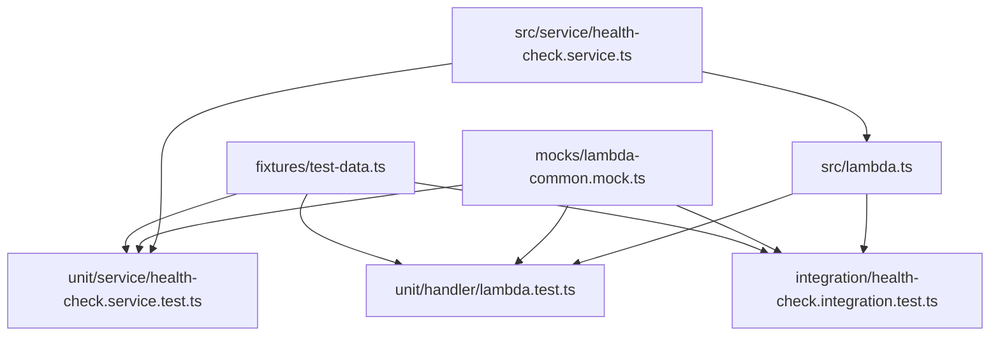

# Health Check Lambda 테스트 가이드

## 개요
이 문서는 Health Check Lambda 함수의 테스트 코드 구조와 실행 방법을 설명합니다.

## 테스트 구조

```
health-check/
├── test/
│   ├── unit/
│   │   ├── handler/
│   │   │   └── lambda.test.ts        # Lambda 핸들러 단위 테스트
│   │   └── service/
│   │       └── health-check.service.test.ts  # 서비스 로직 단위 테스트
│   └── fixtures/
│       └── test-data.ts              # 테스트용 mock 데이터
├── jest.config.js                    # Jest 설정 파일
└── package.json                      # 테스트 스크립트 포함
```

## 사전 준비

### 1. 의존성 설치
```bash
cd lambda/functions/health-check
npm install
```

### 2. 테스트 환경 확인
- Node.js 버전: 18.x 이상
- TypeScript 설정이 올바른지 확인
- @hun_meta/lambda-common 패키지가 설치되어 있는지 확인

## 테스트 실행 방법

### 1. 모든 테스트 실행
```bash
npm test
```

### 2. 특정 테스트 파일 실행
```bash
# 서비스 테스트만 실행
npm test -- health-check.service.test.ts

# Lambda 핸들러 테스트만 실행
npm test -- lambda.test.ts
```

### 3. 테스트 감시 모드 (Watch Mode)
개발 중 파일 변경을 감지하여 자동으로 테스트를 재실행합니다.
```bash
npm run test:watch
```

### 4. 코드 커버리지 확인
```bash
npm run test:coverage
```

커버리지 리포트는 다음 위치에 생성됩니다:
- 터미널 출력: 즉시 확인 가능
- HTML 리포트: `coverage/lcov-report/index.html`

### 5. CI/CD 환경에서 테스트 실행
```bash
npm run test:ci
```

## 테스트 범위

### 1. HealthCheckService 단위 테스트
- **getInstance()**: 싱글톤 패턴 검증
- **healthCheck()**: 정상적인 헬스체크 응답 검증
- **오류 처리**: Date 객체 생성 실패 시 오류 처리
- **로깅**: 적절한 로그 메시지 출력 검증

### 2. Lambda Handler 단위 테스트
- **성공 시나리오**:
  - 요청 본문이 있는 경우
  - 요청 본문이 없는 경우
  - 빈 객체로 요청하는 경우
- **오류 시나리오**:
  - 서비스 오류 발생 시
  - JSON 파싱 오류 발생 시
- **로깅 검증**: 요청/응답 로그 확인

### 3. 코드 커버리지 목표
- Statements: 80% 이상
- Branches: 80% 이상
- Functions: 80% 이상
- Lines: 80% 이상

## 테스트 작성 가이드

### 1. 새로운 테스트 추가하기
```typescript
describe('새로운 기능', () => {
  it('should 예상되는 동작', async () => {
    // Arrange: 테스트 데이터 준비
    const testData = { ... };
    
    // Act: 테스트 대상 실행
    const result = await functionToTest(testData);
    
    // Assert: 결과 검증
    expect(result).toEqual(expectedResult);
  });
});
```

### 2. Mock 사용하기
```typescript
// 외부 의존성 Mock
jest.mock('모듈 경로', () => ({
  methodName: jest.fn(),
}));

// Mock 설정
mockModule.methodName.mockResolvedValue(mockReturnValue);
```

### 3. 테스트 데이터 재사용
`test/fixtures/test-data.ts` 파일의 헬퍼 함수를 사용하여 일관된 테스트 데이터를 생성합니다.

```typescript
import { createMockContext, createMockAPIGatewayEvent } from '../fixtures/test-data';

const mockEvent = createMockAPIGatewayEvent({ requestTimestamp: 123456 });
const mockContext = createMockContext();
```

## 문제 해결

### 1. 테스트가 실패하는 경우
- TypeScript 컴파일 오류 확인: `npm run build`
- 의존성 설치 확인: `npm install`
- Mock 설정이 올바른지 확인

### 2. 커버리지가 낮은 경우
- 테스트되지 않은 코드 경로 확인
- 엣지 케이스 테스트 추가
- 오류 처리 로직 테스트 추가

### 3. 테스트 실행이 느린 경우
- Mock을 활용하여 외부 의존성 제거
- 불필요한 setup/teardown 코드 최적화
- 병렬 실행 옵션 활용

## 지속적 개선

1. **테스트 커버리지 모니터링**: 새로운 코드 추가 시 테스트도 함께 추가
2. **테스트 품질 향상**: 단순 커버리지보다 실제 비즈니스 로직 검증에 집중
3. **테스트 성능 최적화**: 실행 시간이 긴 테스트 개선
4. **문서화**: 복잡한 테스트 시나리오에 대한 설명 추가

## 테스트 아키텍처 및 파일 관계

### 디렉토리 구조 및 역할

```
test/
├── unit/                    # 단위 테스트 (개별 컴포넌트 테스트)
│   ├── handler/            # Lambda 핸들러 레이어 테스트
│   │   └── lambda.test.ts  # API Gateway 이벤트 처리, 에러 핸들링
│   └── service/            # 비즈니스 로직 레이어 테스트
│       └── health-check.service.test.ts  # 헬스체크 로직, 싱글톤 패턴
├── integration/            # 통합 테스트 (전체 플로우 테스트)
│   └── health-check.integration.test.ts  # E2E 시나리오, 성능 테스트
├── fixtures/               # 테스트 데이터 및 헬퍼
│   └── test-data.ts       # 재사용 가능한 Mock 데이터 생성 함수
└── mocks/                 # 외부 의존성 Mock
    └── lambda-common.mock.ts  # @hun_meta/lambda-common 모듈 Mock
```

### 테스트 레이어별 책임

#### 1. **Unit Tests (단위 테스트)**
- **handler/lambda.test.ts**
  - **책임**: API Gateway 이벤트 파싱, HTTP 응답 생성, 에러 핸들링
  - **Mock 대상**: HealthCheckService, ResponseHandler
  - **테스트 범위**: 요청/응답 변환, JSON 파싱 오류, 로깅

- **service/health-check.service.test.ts**
  - **책임**: 비즈니스 로직, 싱글톤 패턴, 타임스탬프 처리
  - **Mock 대상**: Date 객체, Logger
  - **테스트 범위**: 헬스체크 데이터 생성, 오류 처리

#### 2. **Integration Tests (통합 테스트)**
- **health-check.integration.test.ts**
  - **책임**: 전체 플로우 검증, 실제 사용 시나리오
  - **Mock 대상**: 최소한 (외부 의존성만)
  - **테스트 범위**: E2E 플로우, 성능, 동시성

#### 3. **Supporting Files (지원 파일)**
- **fixtures/test-data.ts**
  - **역할**: 일관된 테스트 데이터 생성
  - **제공 기능**: Mock event/context 팩토리 함수
  - **사용처**: 모든 테스트 파일에서 재사용

- **mocks/lambda-common.mock.ts**
  - **역할**: 외부 라이브러리 의존성 제거
  - **Mock 대상**: ResponseHandler, LoggerService
  - **적용 범위**: 모든 테스트에서 자동 적용

### 테스트 간 의존 관계



### 테스트 실행 플로우

1. **Jest 설정 로드** (`jest.config.js`)
2. **Mock 모듈 초기화** (`mocks/lambda-common.mock.ts`)
3. **단위 테스트 실행**
   - Service 테스트 (의존성 없음)
   - Handler 테스트 (Service Mock 사용)
4. **통합 테스트 실행** (전체 플로우 검증)
5. **커버리지 리포트 생성**

### 테스트 전략

- **격리**: 각 테스트는 독립적으로 실행 가능
- **재사용**: fixtures를 통한 데이터 일관성
- **계층화**: Unit → Integration 순서로 신뢰성 구축
- **Mock 최소화**: 통합 테스트에서는 실제 로직 최대한 활용

## 참고 자료
- [Jest 공식 문서](https://jestjs.io/docs/getting-started)
- [AWS Lambda 테스팅 가이드](https://docs.aws.amazon.com/lambda/latest/dg/testing-functions.html)
- [TypeScript 테스팅 베스트 프랙티스](https://www.typescriptlang.org/docs/handbook/testing.html)